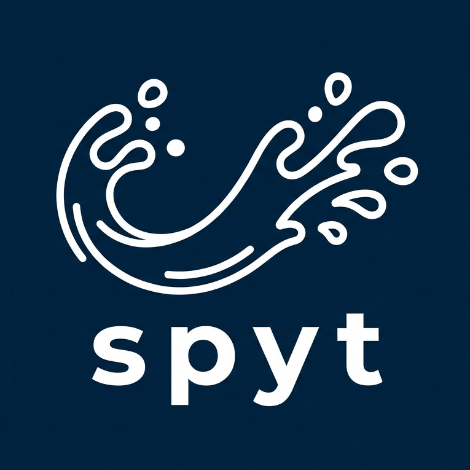

<p align="center">
  
</p>

# spyt

Transfer playlists from Spotify to YouTube Music from your terminal.

```
npx spyt transfer https://open.spotify.com/playlist/37i9dQZF1DXcBWIGoYBM5M
```

## Why spyt?

- **One command** — runs via `npx`, no Python or virtual environments
- **Smart matching** — tries ISRC codes first (exact match), falls back to search with confidence scoring
- **Resumable** — large playlists won't lose progress if rate-limited or interrupted
- **Dry-run mode** — preview matches before creating anything on YouTube Music
- **Transfer reports** — see exactly what matched, what was fuzzy, and what failed

## Setup

### 1. Spotify credentials

Create an app at [developer.spotify.com/dashboard](https://developer.spotify.com/dashboard). Add `http://127.0.0.1:8901/callback` as a redirect URI. You'll need the **Client ID**.

> Spotify requires `127.0.0.1`, not `localhost`, for local redirect URIs.

### 2. Authenticate

```bash
spyt auth spotify
```

Opens your browser for an OAuth flow. Tokens are stored in your system config directory.

```bash
spyt auth youtube
```

YouTube Music has no public API for song search, so spyt authenticates by reusing your browser session — no Google Cloud project or API quota needed. When you run the command:

1. Open [music.youtube.com](https://music.youtube.com) in a logged-in browser.
2. Open DevTools → Network tab.
3. Right-click any request to `music.youtube.com` → **Copy** → **Copy as cURL**.
4. Paste it when prompted (an editor opens).

Alternatively, save the cURL command to a file and pass it directly:

```bash
spyt auth youtube --headers-file ./ytm.curl
```

Cookies are stored in `~/.config/spyt/` with restricted permissions. Re-run this command if you get auth errors — cookies typically last a few weeks.

## Usage

### Transfer a playlist

```bash
spyt transfer https://open.spotify.com/playlist/37i9dQZF1DXcBWIGoYBM5M
```

### Preview matches first (dry run)

```bash
spyt transfer https://open.spotify.com/playlist/... --dry-run
```

### Transfer all your playlists

```bash
spyt transfer --all
```

### Browse and pick playlists interactively

```bash
spyt list
```

### Resume an interrupted transfer

```bash
spyt resume
```

### View past transfer reports

```bash
spyt report --list
spyt report <transfer-id>
spyt report <transfer-id> --json -o report.json
spyt report <transfer-id> --csv -o report.csv
```

## How matching works

For each track in your Spotify playlist:

1. **ISRC lookup** — if the track has an ISRC code, search YouTube with it. A match within 10 seconds of the expected duration counts as **exact**.
2. **Text search** — search YouTube for `"Artist - Track Name"` filtered to the music category.
3. **Scoring** — results are ranked by title similarity (50%), artist match (30%), and duration closeness (20%).
4. **Confidence** — each match is tagged `exact`, `high`, `medium`, `low`, or `none`.

Tracks with `none` confidence are skipped and flagged in the report.

## Match report example

```
Transfer Report: My Favorite Songs

Summary
  Total tracks:   42
  Matched:        39 (93%)
  Not found:      3

  exact: 28  high: 8  medium: 3  low: 0

Track Details
────────────────────────────────────────────────────
  [exact] Queen - Bohemian Rhapsody
         → Queen - Bohemian Rhapsody (Official Video) (isrc)
  [high]  The Weeknd - Blinding Lights
         → The Weeknd - Blinding Lights (Official Music Video) (search)
  [none]  Some Artist - Rare B-Side
         → No match found
```

## Development

```bash
npm install
npm run build          # compile TypeScript
npm run dev            # run via tsx (no build step)
npm test               # run tests
```

## License

MIT
